## 计算机毕业设计Python+大模型新能源汽车销量预测 汽车销量分析可视化 汽车爬虫 深度学习 ARIMA差分自回归移动平均算法 决策树回归模型 Ridge岭回归预测模型

## 要求
### 源码有偿！一套(论文 PPT 源码+sql脚本+教程)

### 
### 加好友前帮忙start一下，并备注github有偿纯Py汽车销量预测
### 我的QQ号是2827724252或者798059319或者 1679232425或者微信:bysj2023nb

# 

### 加qq好友说明（被部分 网友整得心力交瘁）：
    1.加好友务必按照格式备注
    2.避免浪费各自的时间！
    3.当“客服”不容易，repo 主是体面人，不爆粗，性格好，文明人。
## 介绍
基于Python的新能源汽车销量分析与预测系统是一个使用Python编程语言和Flask框架开发的系统。它可以帮助用户分析和预测新能源汽车的销量情况。该系统使用了关系数据库进行数据存储，并使用了一些前端技术如HTML、JavaScript、jQuery、Bootstrap和Echarts框架来实现用户界面的设计和交互。

该系统的主要功能包括：

1、数据采集和清洗：通过网络爬虫采集新能源汽车销售数据，并对数据进行清洗、数据库存储，以便后续分析使用。

2、数据可视化：将清洗后的数据以图表的形式展示，如折线图、柱状图等，帮助用户直观地了解销量情况和趋势。

3、数据分析：通过统计学和机器学习算法对销售数据进行分析，提取关键特征和规律，帮助用户发现影响销量的因素。

4、销量预测：基于历史销售数据和分析结果，采用ARIMA差分自回归移动平均算法、决策树回归和Ridge岭回归等预测模型对未来销量进行预测，帮助用户做出决策和制定销售策略。

通过该系统，用户可以方便地进行新能源汽车销量分析和预测，从而更好地了解市场需求和制定销售策略。

## 演示视频
https://www.bilibili.com/video/BV1zND8YUEPh/?spm_id_from=333.999.0.0

## 演示截图

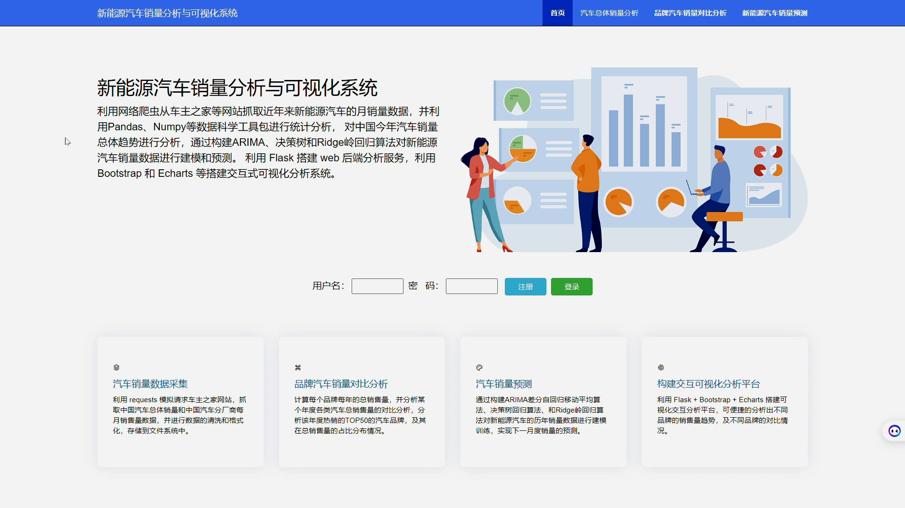
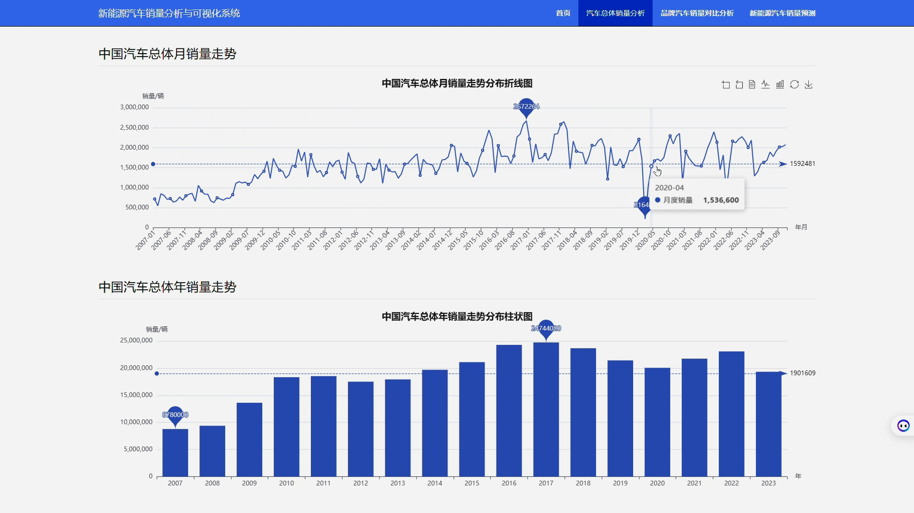
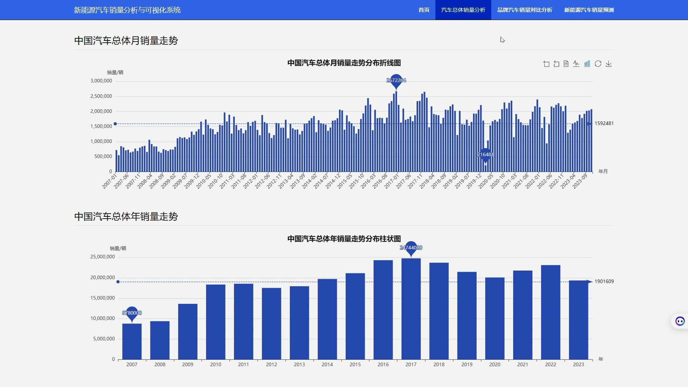
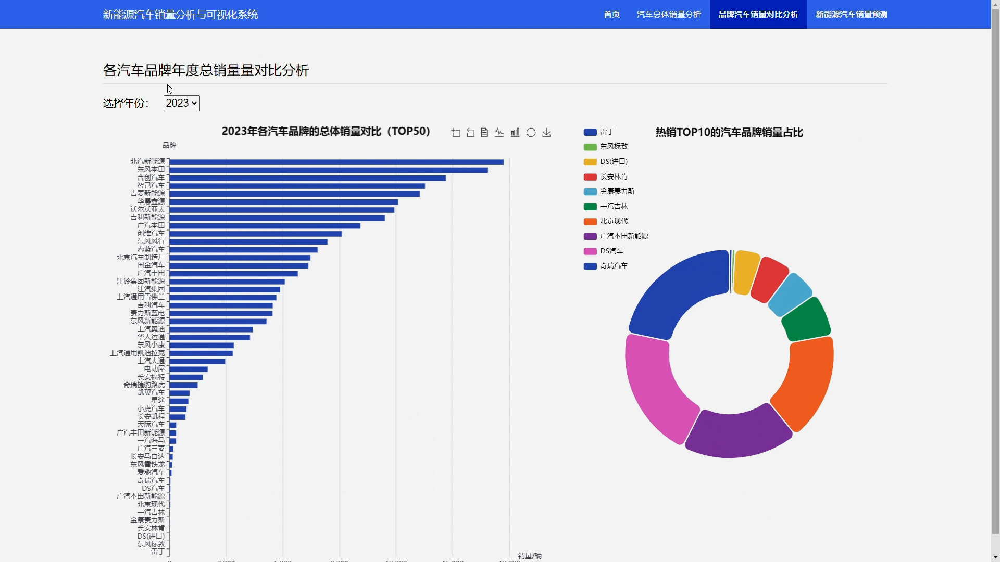
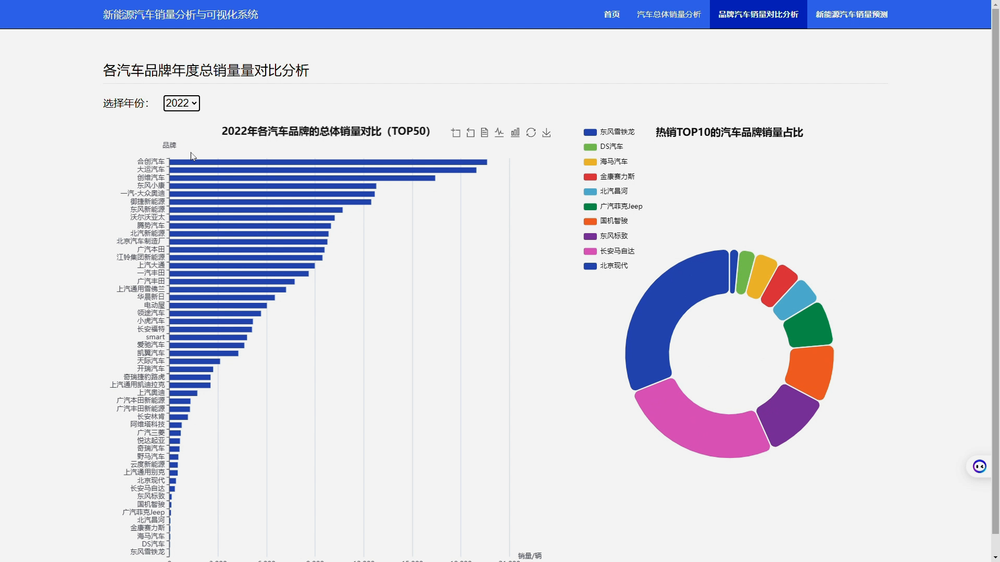
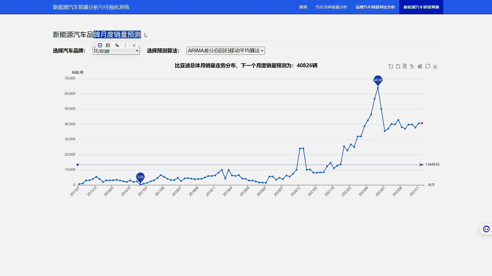
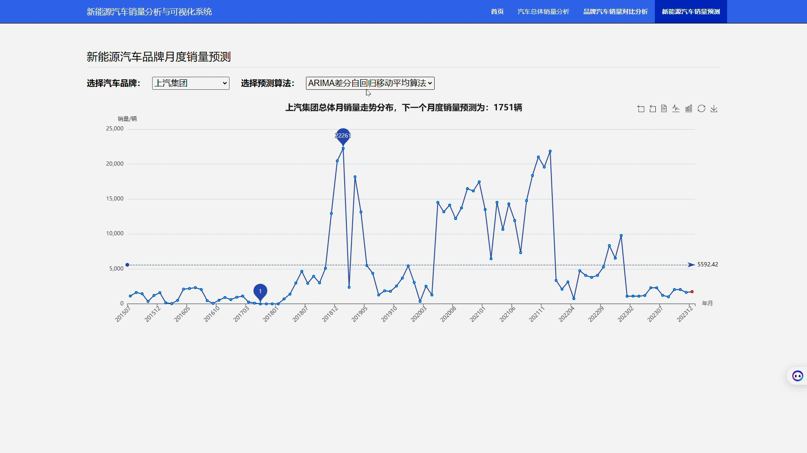
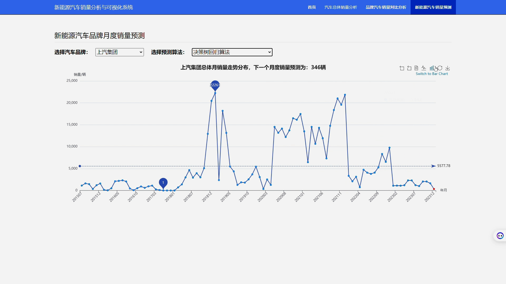
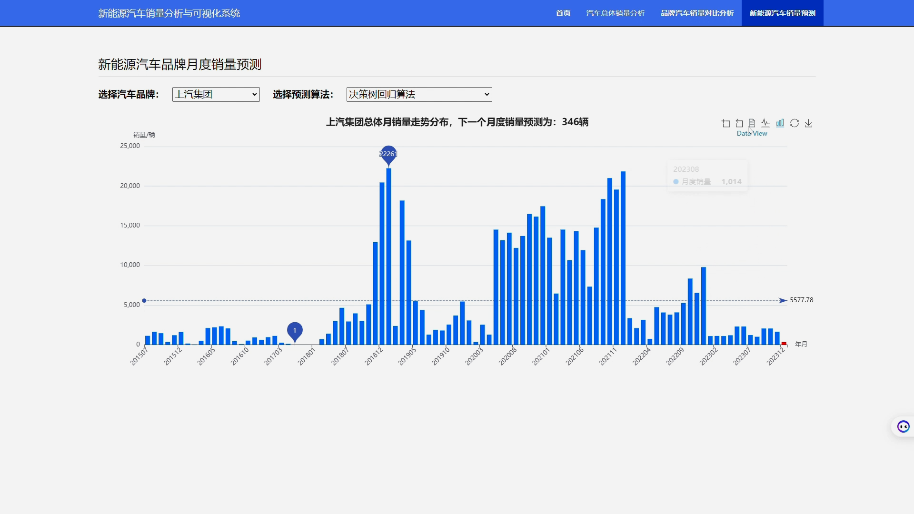
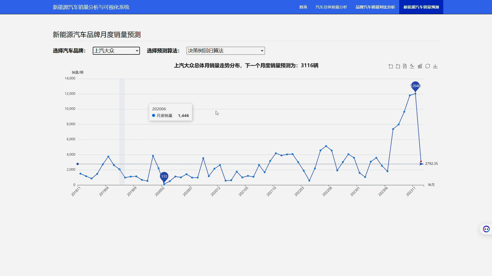
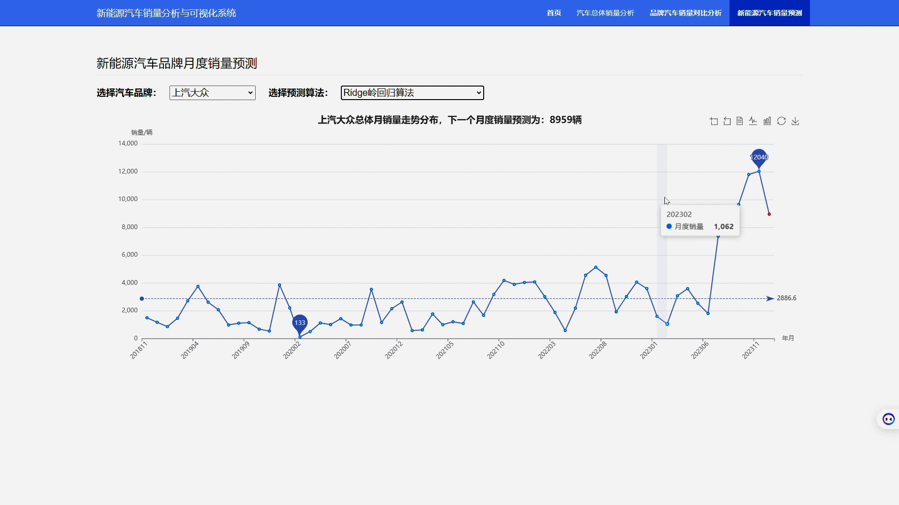
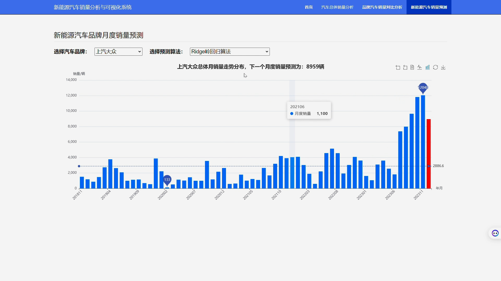

